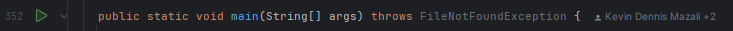

# Ruteoptimalisering med ALT og Dijkstra-algoritmer

Dette prosjektet implementerer en løsning for korteste-vei problemet ved bruk av kartdata fra Norden. Programmet benytter både Dijkstra-algoritmen og ALT-søkealgoritmen (A*, Landemerker, Trekantulikhet) for å sammenligne ytelse og nøyaktighet. I tillegg tilbyr programmet funksjonalitet for å finne nærmeste interessepunkter (POI).

## Funksjonalitet

- **Korteste vei**: Beregn den raskeste kjøreruten mellom to punkter med Dijkstra og ALT.
- **Ytelsesmålinger**: Mål kjøretid og antall noder behandlet for begge algoritmene.
- **Interessepunkter**: Finn de fire nærmeste POI (f.eks. bensinstasjoner, kafeer) til et gitt sted.
- **Forbehandling**: Effektiv prosessering av kartdata for å optimalisere ALT-søk.
- **Visualisering**: Vis reiseruter grafisk ved bruk av koordinater kompatible med Google Maps.
- **Skalerbarhet**: Håndter store datasett med millioner av noder og kanter.

## Krav

- **Datafiler**:
  - **Noder**: Inneholder koordinater for hver node (nodenummer, breddegrad, lengdegrad).
  - **Kanter**: Definerer forbindelser mellom noder med vekting (kjøretid, lengde, fartsgrense).
  - **Interessepunkter**: Node-ID og kategorier (f.eks. ladestasjoner, restauranter).

## Implementasjonsdetaljer

### Dijkstra-algoritmen
- Beregner korteste vei ved å prioritere noder basert på avstand fra start.

### ALT-algoritmen
- Utvider A* med forhåndsberegnede avstander til/fra landemerker.
- Bruker trekantulikheten for å estimere avstanden til målet, noe som forbedrer effektiviteten.

### Forbehandling
- Landemerkeavstander beregnes med Dijkstra-algoritmen på både det originale og omvendte grafen.
- Data lagres i eksterne filer for rask tilgang ved søk.

## Bruk

1. **Oppsett**: Last ned nødvendige kartfiler. Kjør forbehandling for ALT-algoritmen.
2. **Utføring**: Start programmet med spesifisert start- og målnode for å sammenligne resultatene fra Dijkstra og ALT.
3. **Visualisering**: Generer ruter i et format som kan vises i eksterne verktøy som Google Maps.
4. **Ytelsesanalyse**: Sammenlign kjøringstid og antall behandlede noder for begge algoritmene.

Kjør programmet vha psvm i Dijkstra.Java filen

## Utdata

- **Ruteinformasjon**: Liste over noder i ruten og total reisetid (tt:mm:ss).
- **Ytelsesmålinger**: Kjøretid og antall behandlede noder for hver algoritme.
- **Interessepunkter**: Liste og visualisering av nærmeste POI til en valgt node.

## Visualisering

For å vise ruter, eksporter nodekoordinater og bruk:
- **Google Maps**: Lim inn koordinatlister for å plotte ruter.

## Bidragsytere

Prosjektet er utviklet som en del av kurset Algoritmer og Datastrukturer ved NTNU.

